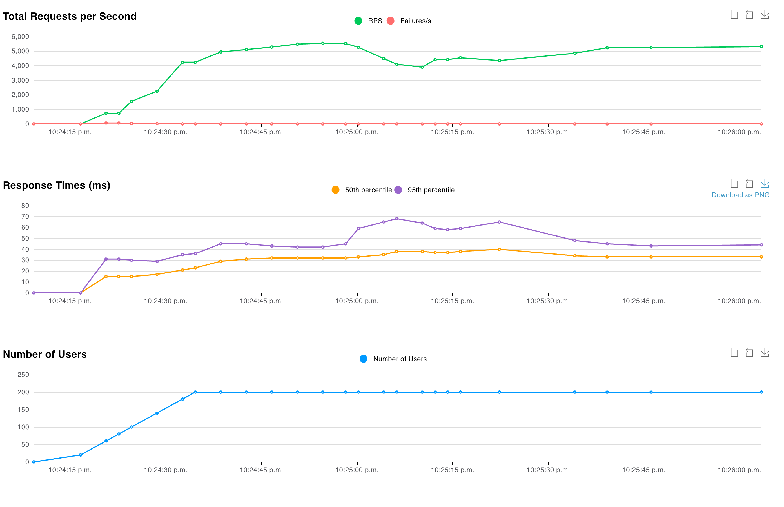
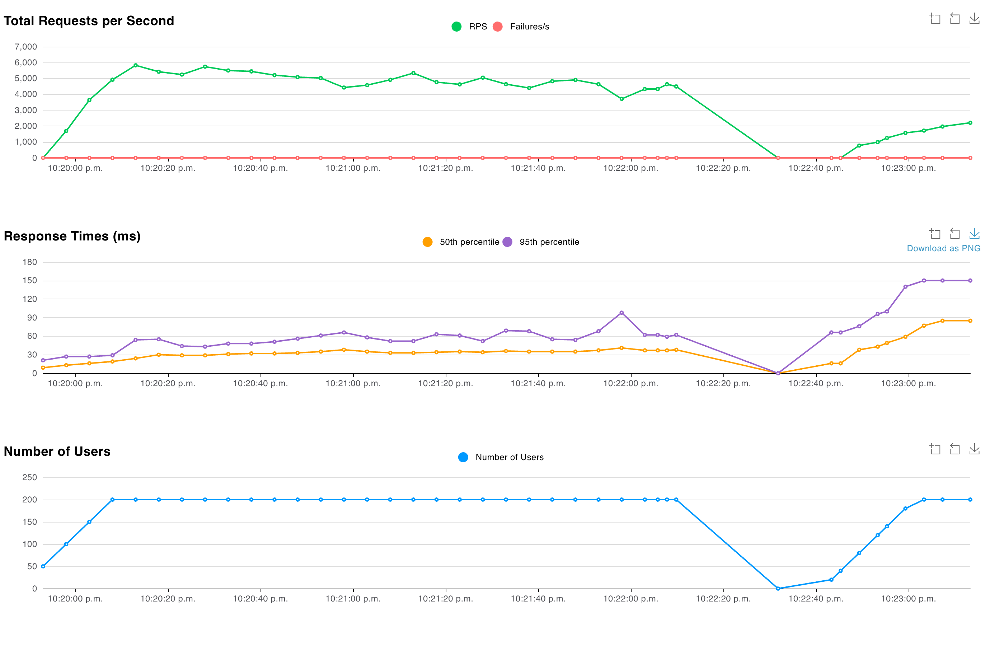
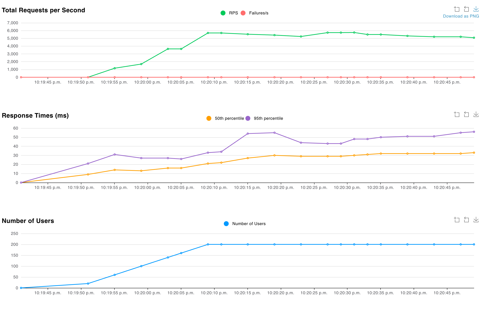

# Laboratorio 1 - Concurrent Booking System

Sistema de reserva de tickets para eventos concurrentes. Se evaluaron diferentes estrategias de control de concurrencia para evitar overbooking bajo carga de 200 usuarios concurrentes (Locust).

## Ramas

| Rama | Estrategia | Descripción |
|------|------------|-------------|
| `main` | Validación atómica | Un solo `UPDATE` con `WHERE availableStock > 0`. Sin locks, sin reads previos. La mejor approach. |
| `pessimistic-lab1` | Pessimistic locking | `findById` con `@Lock(PESSIMISTIC_WRITE)` antes de decrementar. Bloquea la fila durante toda la transacción. |
| `optimistic-lab1` | Optimistic locking | `findById` con `@Version` en la entidad. Si hay conflicto, lanza `OptimisticLockException` y el cliente debe reintentar. |

## Problema: Validación en memoria sin protección

Cuando se lee el stock, se valida en memoria y luego se actualiza sin ningún mecanismo de concurrencia, el proceso concurrente permite que múltiples requests lean el mismo stock antes de que cualquiera escriba. Esto provoca overbooking ya que no hay protección a nivel de base de datos.

```java
// Problemático - sin protección atómica
Optional<Event> optionalEvent = eventRepository.findById(dto.eventId());
Event event = optionalEvent.get();
if(event.getAvailableStock() <= 0) return -1L;
event.setAvailableStock(event.getAvailableStock() - 1); // Race condition
bookingRepository.save(booking);
```

## Soluciones

### Pessimistic Locking (`pessimistic-lab1`)

Bloquea la fila en la base de datos con `SELECT ... FOR UPDATE` antes de leer. El problema es que convierte el proceso concurrente en secuencial: todas las requests quedan pendientes hasta que la transacción termine, aumentando los percentiles 50 y 95.

```java
@Lock(LockModeType.PESSIMISTIC_WRITE)
@Query("SELECT e FROM Event e WHERE id = :id")
Optional<Event> findByIdWithPessimisticLock(@Param("id") long id);
```

### Optimistic Locking (`optimistic-lab1`)

Utiliza un campo `@Version` en la entidad. No bloquea la fila, el proceso se mantiene concurrente. Si dos transacciones intentan modificar el mismo registro, la segunda lanza `OptimisticLockException` y debe reintentar. Mejor performance que pessimistic pero con overhead de reintentos.

```java
@Entity
public class Event {
    @Id
    private Long id;

    @Column(name = "available_stock")
    private Long availableStock;

    @Version
    private Integer version;
}
```

### Validación Atómica (`main`)

Un solo query `UPDATE` con condición `WHERE availableStock > 0`. No bloquea filas, no hay reads, no hay reintentos. El mejor approach para este caso de uso.

```java
@Modifying
@Query("""
    UPDATE Event SET availableStock = availableStock - 1
    WHERE id = :id AND availableStock > 0
""")
int actualizarEspaciosDisponibles(@Param("id") Long id);
```

## Benchmarks (Locust - 200 usuarios concurrentes)

### Optimistic Locking



- **p50**: ~30ms | **p95**: ~45ms
- No bloquea la fila, el proceso se mantiene concurrente. El performance es mejor que pessimistic pero el número de reintentos que un usuario debe realizar para comprar un ticket aumenta considerablemente.

### Pessimistic Locking



- **p50**: ~81ms | **p95**: ~140ms
- Convierte el proceso concurrente en secuencial. La fila se bloquea durante toda la transacción y las requests quedan pendientes hasta que acabe, aumentando notablemente los percentiles 50 y 95.

### Validación Atómica (mejor approach)



- **p50**: ~21ms | **p95**: ~33ms
- La fila solo se bloquea en milésimas de segundo durante el UPDATE. Sin reintentos, sin overbooking. Mejor performance de los tres approaches.

## Stack

- Java 25 / Spring Boot
- PostgreSQL
- Locust ( benchmarks )


## Lecciones aprendidas

- Usar locust para pruebas de api rest con 200 usuarios concurrentes e identificar en los diferentes escenarios el comportamiento de los percentiles p50 y p95
- Aplicación de LockModeType en transacciones en problemas de concurrencia y verificar como afecta en performance uno u otro